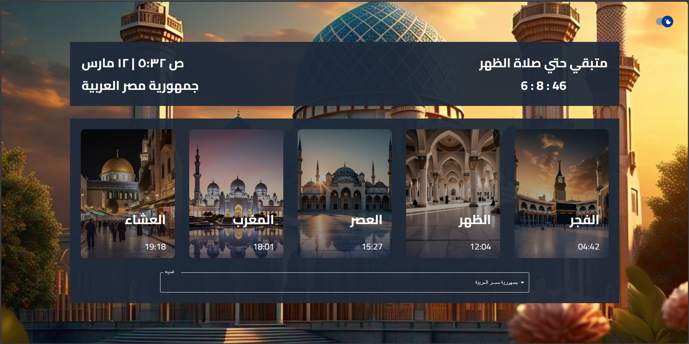

# **📌 Islamic Prayer Times SPA**  

## **🌟 Overview**  
This is a **Single Page Application (SPA)** built with **React, TypeScript, and TanStack Query**, providing accurate **Islamic prayer times** for different cities worldwide. Users can select their country and city to view prayer schedules and track the time remaining for the next prayer.  

---

## **🚀 Features**  
✅ Fetches real-time **Islamic prayer times** via [Aladhan API](https://aladhan.com/).  
✅ **Dynamic city selection** with automatic data fetching.  
✅ **Live countdown timer** showing time left for the next prayer.  
✅ **Light/Dark mode toggle** for better accessibility.  
✅ **Optimized state management** with **React Context API** and **TanStack Query**.  
✅ **Responsive UI** using **Tailwind CSS** and **Material UI**.  

---

## **🛠️ Technologies Used**  
| Technology | Purpose |
|------------|---------|
| **React (Vite)** | Frontend Framework |
| **TypeScript** | Type safety & improved development |
| **Tailwind CSS** | Utility-first styling |
| **Material UI** | Pre-built UI components |
| **Context API** | Global state management |
| **TanStack Query** | API state & caching |
| **Axios** | HTTP requests |
| **Moment.js** | Time calculations & formatting |

---

## **📦 Installation & Setup**  
### **1️⃣ Clone the Repository**  
```sh
git clone https://github.com/MahmoudSamyDev/prayer-times-app.git
cd prayer-times-app
```

### **2️⃣ Install Dependencies**  
```sh
npm install
# or
yarn install
```

### **3️⃣ Create a `.env` File**  
Add your **Aladhan API URL** in a `.env` file:  
```env
VITE_API_URL=https://api.aladhan.com/v1/timingsByCity/
```

### **4️⃣ Run the App**  
```sh
npm run dev
# or
yarn dev
```
Then open **http://localhost:5173/** in your browser.

---

## **🖼️ Project Structure**  
```
📦 src
 ┣ 📂 assets        # Utility files (Axios instance)
 ┣ 📂 Components    # UI components (theme switch, cards, etc.)
 ┣ 📂 Functions
 ┃ ┣ 📂 APICalls   # API fetching functions
 ┃ ┣ 📂 Hooks      # Custom hooks (TanStack Query, Context API)
 ┣ 📂 Home         # Main app pages
 ┣ 📂 utilities    # Static data, helper functions
 ┣ 📜 App.tsx      # Main application component
 ┣ 📜 main.tsx     # React entry point
```

---

## **🔗 API Usage & Response Example**  
- **API Request:**  
  ```
  GET https://api.aladhan.com/v1/timingsByCity/{date}/?country={COUNTRY}&city={CITY}
  ```

- **Example API Response:**  
  ```json
  {
    "Fajr": "04:50",
    "Dhuhr": "12:30",
    "Asr": "16:00",
    "Maghrib": "18:45",
    "Isha": "20:15"
  }
  ```

---

## **🎯 How It Works**  
1️⃣ User selects a **city** from the dropdown.  
2️⃣ The app **fetches the prayer times** for that location via the **Aladhan API**.  
3️⃣ The **next prayer time and countdown** are dynamically updated using **Moment.js**.  
4️⃣ Users can toggle between **light and dark themes**.  
5️⃣ **React Query handles API state** and caching to improve performance.  

---

## **📸 Screenshots**
### **Dark mode**


### **Light mode**


## **📸 Video**
[](public/Recording.mp4)

## **🤝 Contributing**  
Contributions are welcome! If you’d like to improve this project:  
1. **Fork** the repository.  
2. **Create a new branch** (`feature-new` or `fix-bug`).  
3. **Commit your changes**.  
4. **Submit a Pull Request**.  

---

## **📜 License**  
This project is **open-source** and available under the **MIT License**.

---

## **💬 Contact & Support**  
Have a question or suggestion? Feel free to reach out:  
📧 **Email:** mahmoud.samy.elshora@gmail.com 
🔗 **GitHub:** [your-username](https://github.com/MahmoudSamyDev)  